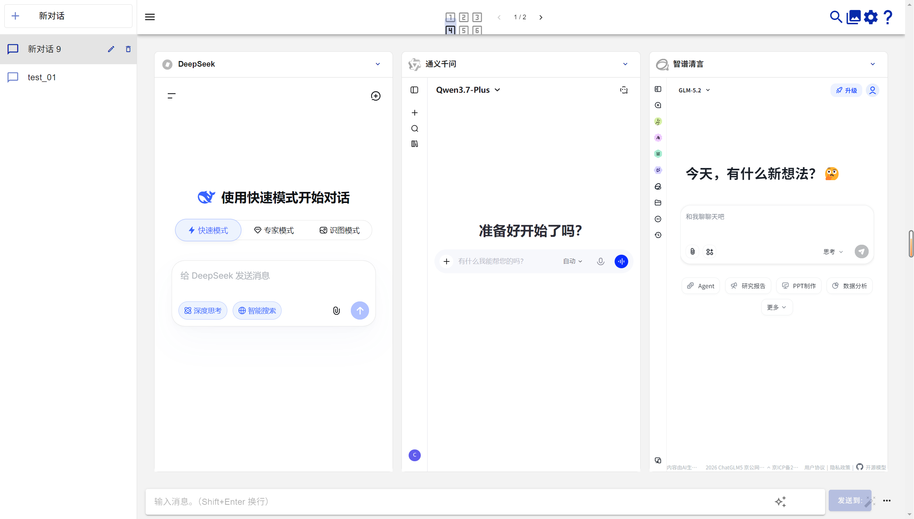

<div align="center">
  <h1>AI Chat Hub</h1>
  <p><strong>Uno spazio di lavoro desktop per confrontare conversazioni IA</strong></p>

[Deutsch](README_DE-DE.md) | [English](README.md) | [Espanol](README_ES-ES.md) | [Francais](README_FR-FR.md) | Italiano | [Japanese](README_JA-JP.md) | [Korean](README_KO-KR.md) | [Russian](README_RU-RU.md) | [Tieng Viet](README_VI-VN.md) | [Chinese](README_ZH-CN.md)

</div>

## Presentazione del prodotto

`AI Chat Hub` e uno spazio di lavoro desktop Electron che invia lo stesso prompt a piu modelli IA e ne confronta i risultati in un unico punto. Selezione dei modelli, conversazioni e lavoro successivo rimangono in un ambiente locale.



## Funzionalita

- Confronta le risposte in uno fino a sei pannelli di modelli.
- Accedi alle chat web ufficiali supportate, tra cui [DeepSeek](https://chat.deepseek.com/), [Qianwen](https://chat.qwen.ai/), [Kimi](https://kimi.moonshot.cn/), [ChatGLM](https://chatglm.cn/) e Doubao.
- Configura modelli API di OpenAI, Azure OpenAI, Anthropic, Google, Cohere, Groq, xAI, Baidu ed endpoint compatibili con OpenAI.
- Migliora i prompt, allega file di testo o codice come contesto e genera immagini con un modello API OpenAI configurato.
- Crea un riepilogo rapido oppure analizza consenso e differenze tra le risposte selezionate.
- Salva localmente conversazioni, prompt e impostazioni; gestisce piu conversazioni, layout e impostazioni proxy.

## Accesso web ufficiale

I seguenti provider sono disponibili nello spazio web ufficiale integrato. Le voci pianificate riflettono l'ambito di accesso web del progetto sorgente e non sono ancora disponibili.

| Provider                                                                       | URL                                                                | Accesso web ufficiale         | Stato                             |
| ------------------------------------------------------------------------------ | ------------------------------------------------------------------ | ----------------------------- | --------------------------------- |
| [DeepSeek](https://chat.deepseek.com/)                                         | <https://chat.deepseek.com/>                                       | Supportato                    | Spazio web ufficiale integrato    |
| [Qianwen](https://chat.qwen.ai/)                                               | <https://chat.qwen.ai/>                                            | Supportato                    | Spazio web ufficiale integrato    |
| [Kimi](https://kimi.moonshot.cn/)                                              | <https://kimi.moonshot.cn/>                                        | Supportato                    | Spazio web ufficiale integrato    |
| [ChatGLM](https://chatglm.cn/)                                                 | <https://chatglm.cn/>                                              | Supportato                    | Spazio web ufficiale integrato    |
| [Doubao](https://www.doubao.com/chat/)                                         | <https://www.doubao.com/chat/>                                     | Supportato                    | Spazio web ufficiale integrato    |
| [360 AI Brain](https://ai.360.cn/)                                             | <https://ai.360.cn/>                                               | [Pi](https://pi.ai/)anificato | Precedente ambito di accesso web  |
| [Character.AI](https://character.ai/)                                          | <https://character.ai/>                                            | [Pi](https://pi.ai/)anificato | Precedente ambito di accesso web  |
| [ChatGPT](https://chatgpt.com/)                                                | <https://chatgpt.com/>                                             | [Pi](https://pi.ai/)anificato | Precedente ambito di accesso web  |
| [Claude](https://www.anthropic.com/claude)                                     | <https://www.anthropic.com/claude>                                 | [Pi](https://pi.ai/)anificato | Precedente ambito di accesso web  |
| [Code Llama](https://ai.meta.com/blog/code-llama-large-language-model-coding/) | <https://ai.meta.com/blog/code-llama-large-language-model-coding/> | [Pi](https://pi.ai/)anificato | Precedente ambito di accesso web  |
| [Copilot](https://copilot.microsoft.com/)                                      | <https://copilot.microsoft.com/>                                   | [Pi](https://pi.ai/)anificato | Precedente ambito di accesso web  |
| [Dedao Learning Assistant](https://ai.dedao.cn/)                               | <https://ai.dedao.cn/>                                             | [Pi](https://pi.ai/)anificato | Precedente ambito web pianificato |
| [Falcon 180B](https://huggingface.co/tiiuae/falcon-180b-chat)                  | <https://huggingface.co/tiiuae/falcon-180b-chat>                   | [Pi](https://pi.ai/)anificato | Precedente ambito di accesso web  |
| [Gemini](https://gemini.google.com/)                                           | <https://gemini.google.com/>                                       | [Pi](https://pi.ai/)anificato | Precedente ambito di accesso web  |
| [Gemma 2B & 7B](https://blog.google/technology/developers/gemma-open-models/)  | <https://blog.google/technology/developers/gemma-open-models/>     | [Pi](https://pi.ai/)anificato | Precedente ambito di accesso web  |
| [Gradio](https://gradio.app/)                                                  | <https://gradio.app/>                                              | [Pi](https://pi.ai/)anificato | Precedente ambito di accesso web  |
| [HuggingChat](https://huggingface.co/chat/)                                    | <https://huggingface.co/chat/>                                     | [Pi](https://pi.ai/)anificato | Precedente ambito di accesso web  |
| [iFLYTEK SPARK](http://xinghuo.xfyun.cn/)                                      | <http://xinghuo.xfyun.cn/>                                         | [Pi](https://pi.ai/)anificato | Precedente ambito di accesso web  |
| [Llama 2](https://ai.meta.com/llama/)                                          | <https://ai.meta.com/llama/>                                       | [Pi](https://pi.ai/)anificato | Precedente ambito di accesso web  |
| [MOSS](https://moss.fastnlp.top/)                                              | <https://moss.fastnlp.top/>                                        | [Pi](https://pi.ai/)anificato | Precedente ambito di accesso web  |
| [Perplexity](https://www.perplexity.ai/)                                       | <https://www.perplexity.ai/>                                       | [Pi](https://pi.ai/)anificato | Precedente ambito di accesso web  |
| [Phind](https://www.phind.com/)                                                | <https://www.phind.com/>                                           | [Pi](https://pi.ai/)anificato | Precedente ambito di accesso web  |
| [Pi](https://pi.ai/)                                                           | <https://pi.ai/>                                                   | [Pi](https://pi.ai/)anificato | Precedente ambito di accesso web  |
| [Poe](https://poe.com/)                                                        | <https://poe.com/>                                                 | [Pi](https://pi.ai/)anificato | Precedente ambito di accesso web  |
| [SkyWork](https://neice.tiangong.cn/)                                          | <https://neice.tiangong.cn/>                                       | [Pi](https://pi.ai/)anificato | Precedente ambito di accesso web  |
| [Vicuna](https://lmsys.org/blog/2023-03-30-vicuna/)                            | <https://lmsys.org/blog/2023-03-30-vicuna/>                        | [Pi](https://pi.ai/)anificato | Precedente ambito di accesso web  |
| [WizardLM](https://github.com/nlpxucan/WizardLM)                               | <https://github.com/nlpxucan/WizardLM>                             | [Pi](https://pi.ai/)anificato | Precedente ambito di accesso web  |
| [YouChat](https://you.com/)                                                    | <https://you.com/>                                                 | [Pi](https://pi.ai/)anificato | Precedente ambito di accesso web  |
| [You](https://you.com/)                                                        | <https://you.com/>                                                 | [Pi](https://pi.ai/)anificato | Precedente ambito di accesso web  |
| [Zephyr](https://huggingface.co/spaces/HuggingFaceH4/zephyr-chat)              | <https://huggingface.co/spaces/HuggingFaceH4/zephyr-chat>          | [Pi](https://pi.ai/)anificato | Precedente ambito di accesso web  |

## Per iniziare

1. Avvia `AI Chat Hub` e scegli un modello per ogni pannello di confronto.
2. Per un modello web ufficiale, accedi nel pannello integrato. Per un modello API, aggiungi le credenziali nelle Impostazioni.
3. Scrivi un prompt e invialo ai pannelli selezionati.
4. Esamina le risposte affiancate e, quando serve, riepilogale o analizzale.

Sono necessari un account valido o una chiave API per i modelli utilizzati e l'accesso di rete al relativo servizio.

## Privacy

Conversazioni, impostazioni e credenziali sono archiviate localmente sul computer. Le chiavi API non vengono incluse nell'esportazione dei dati delle chat.

## Eseguire AI Chat Hub

### Eseguire dal codice sorgente

Installa Node.js 20 e npm, quindi esegui questi comandi dalla cartella principale del repository:

```bash
npm install
npm run electron:serve
```

Mantieni aperto il terminale. Usa la finestra Electron aperta automaticamente; `http://localhost:8080` nel browser non supporta le pagine di chat ufficiali integrate.

### Eseguire l'EXE di Windows

1. Scarica il programma di installazione `.exe` o crealo con il comando seguente. Le build locali sono salvate in `dist_electron/`.
2. Fai doppio clic sul file `.exe` e completa la procedura di installazione.
3. Avvia l'app dal collegamento sul desktop, dal menu Start o dalla cartella di installazione.

Le build locali non sono firmate. Se appare SmartScreen, scegli **Ulteriori informazioni > Esegui comunque** solo se ritieni attendibile l'origine.

### Creare il programma di installazione

Genera un pacchetto desktop per la piattaforma corrente:

```bash
npm run electron:build
```

## Feedback

Segnala problemi o proponi funzioni in [GitHub Issues](https://github.com/justforyoudear/Chat_all/issues).

## Sponsor
